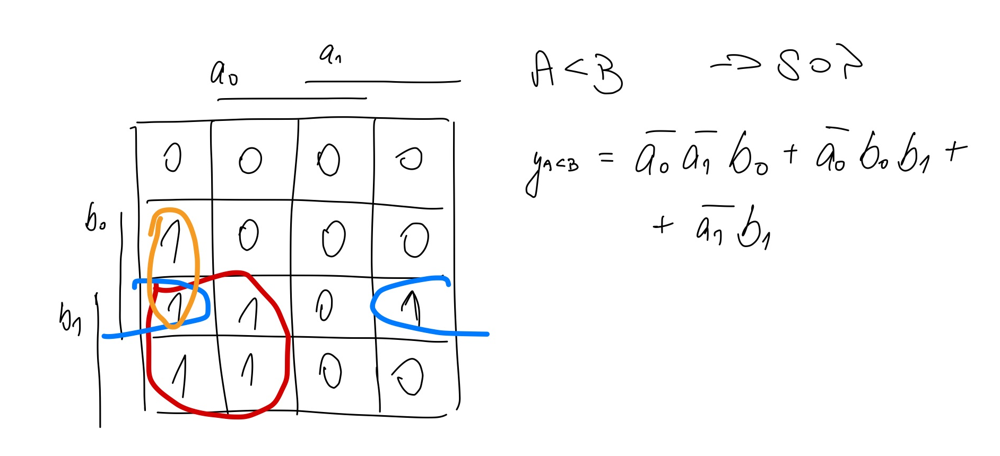
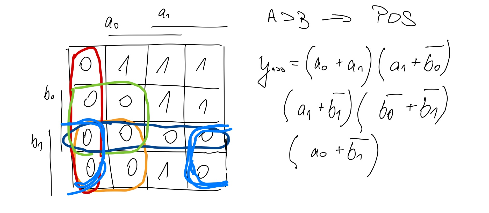
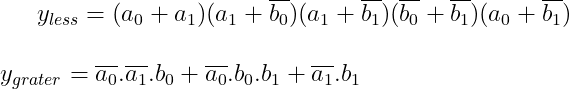
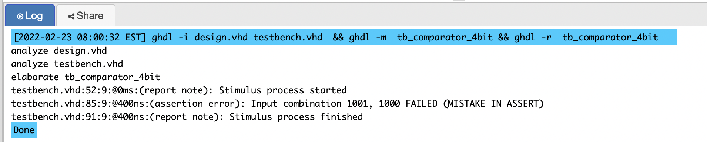

# Lab 2: David ZIMNIOK

### 2-bit comparator

1. Karnaugh maps for other two functions:

   Greater than:

   

   Less than:

   

2. Equations of simplified SoP (Sum of the Products) form of the "greater than" function and simplified PoS (Product of the Sums) form of the "less than" function.

   

### 4-bit comparator

1. Listing of VHDL stimulus process from testbench file (`testbench.vhd`) with at least one assert (use BCD codes of your student ID digits as input combinations). Always use syntax highlighting, meaningful comments, and follow VHDL guidelines:

   Last two digits of my student ID: 230 354 -> 5 4 in BCD (1001 and 1000)

```vhdl
    p_stimulus : process
    begin
        -- Report a note at the beginning of stimulus process
        report "Stimulus process started" severity note;
		
        -- test on student ID: 230354
        s_b <= "1001"; 
        s_a <= "1000"; 
        wait for 100 ns;
        -- ... and its expected outputs
        assert ((s_B_greater_A = '1') and
               (s_B_equals_A  = '0') and
               (s_B_less_A    = '0'))
        -- If false, then report an error
        -- If true, then do not report anything
        report "Input combination 1001, 1000 FAILED" severity error;
        
        s_b <= "1001"; 
        s_a <= "1001"; 
        wait for 100 ns;
        assert ((s_B_greater_A = '0') and
               (s_B_equals_A  = '1') and
               (s_B_less_A    = '0'))
        report "Input combination 1001, 1001 FAILED" severity error;
        
        s_b <= "1000"; 
        s_a <= "1001"; 
        wait for 100 ns;
        assert ((s_B_greater_A = '0') and
               (s_B_equals_A  = '0') and
               (s_B_less_A    = '1'))
        report "Input combination 1000, 1001 FAILED" severity error;
        
        s_b <= "1001"; 
        s_a <= "1000"; 
        wait for 100 ns;
        assert ((s_B_greater_A = '0') and
               (s_B_equals_A  = '1') and
               (s_B_less_A    = '0'))
        report "Input combination 1001, 1000 FAILED (MISTAKE IN ASSERT)" severity error;

        -- Report a note at the end of stimulus process
        report "Stimulus process finished" severity note;
        wait; -- Data generation process is suspended forever
    end process p_stimulus;
```

2. Text console screenshot during your simulation, including reports.

   

3. Link to your public EDA Playground example:

   [https://www.edaplayground.com/x/D9pt](https://www.edaplayground.com/x/D9pt)
