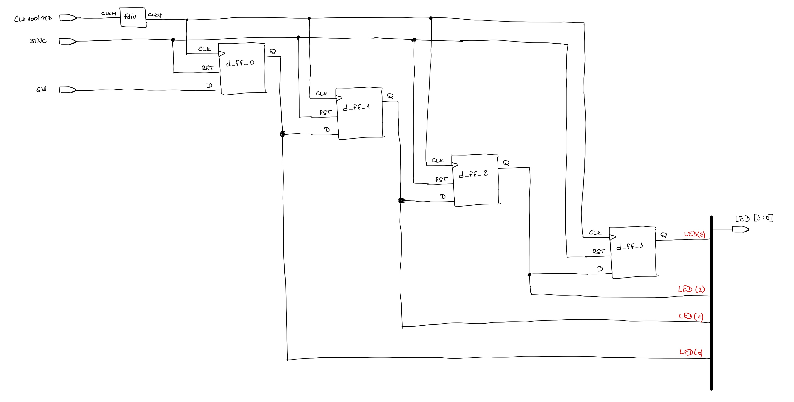

# Lab 5: David ZIMNIOK

### Flip-flops

1. Listing of VHDL architecture for T-type flip-flop. Always use syntax highlighting, meaningful comments, and follow VHDL guidelines:

```vhdl
architecture Behavioral of t_ff_rst is

--define signal with last value of output
signal q_out : STD_LOGIC;

begin
    --------------------------------------------------------
    -- p_t_ff_rst:
    -- T type flip-flop with a high-active sync reset,
    -- rising-edge clk.
    -- q(n+1) = t*/q(n-1)+/t*q(n-1)
    --------------------------------------------------------
    p_t_ff_rst : process(clk)
    begin
        if rising_edge(clk) then  -- Synchronous process
                if rst='1' then
                    q_out <= '0';
                else
                    q_out <= (t AND (not q_out)) OR (q_out AND (not t));
                end if;
        end if;
    end process p_t_ff_rst;
    
    --connection of signal to output
    q     <= q_out;
    q_bar <= not q_out;
    
end architecture Behavioral;
```

2. Screenshot with simulated time waveforms. Try to simulate both flip-flops in a single testbench with a maximum duration of 200 ns, including reset. Always display all inputs and outputs (display the inputs at the top of the image, the outputs below them) at the appropriate time scale!

   

### Shift register

1. Image of the shift register `top` level schematic. The image can be drawn on a computer or by hand. Always name all inputs, outputs, components and internal signals!

   
   
note: Added a frequency divider for better visibility on real board. After lab I have find out that schematic from Vivado don`t show all connections properly. But function and top entity are right. The same schematic was genereated for version without frequency divider. So I have created hand draw schematic.

   
