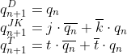

# Lab 5: Latches and Flip-flops

## Preparation tasks (done before the lab at home)

1. Write characteristic equations and complete truth tables for D, JK, T flip-flops where `q(n)` represents main output value before the clock edge and `q(n+1)` represents value after the clock edge.

   | **clk** | **d** | **q(n)** | **q(n+1)** | **Comments** |
   | :-: | :-: | :-: | :-: | :-- |
   |  | 0 | 0 | 0 | input 'D' is moved to the output at rising edge |
   |  | 0 | 1 | 0 | input 'D' is moved to the output at rising edge |
   |  | 1 | 0 | 1 | input 'D' is moved to the output at rising edge |
   |  | 1 | 1 | 1 | input 'D' is moved to the output at rising edge |

   | **clk** | **j** | **k** | **q(n)** | **q(n+1)** | **Comments** |
   | :-: | :-: | :-: | :-: | :-: | :-- |
   |  | 0 | 0 | 0 | 0 | No change |
   |  | 0 | 0 | 1 | 1 | No change |
   |  | 0 | 1 | 0 | 0 | 'K' sets logical 0 at output |
   |  | 0 | 1 | 1 | 0 | 'K' sets logical 0 at output |
   |  | 1 | 0 | 0 | 1 | 'J' sets logical 1 at output |
   |  | 1 | 0 | 1 | 1 | 'J' sets logical 1 at output |
   |  | 1 | 1 | 0 | 1 | 'J' sets logical 1 at output |
   |  | 1 | 1 | 1 | 0 | Inversion of input ('q(n)') |

   | **clk** | **t** | **q(n)** | **q(n+1)** | **Comments** |
   | :-: | :-: | :-: | :-: | :-- |
   |  | 0 | 0 | 0 | No change |
   |  | 0 | 1 | 1 | No change |
   |  | 1 | 0 | 1 | Inversion of input |
   |  | 1 | 1 | 0 | Inversion of input |
