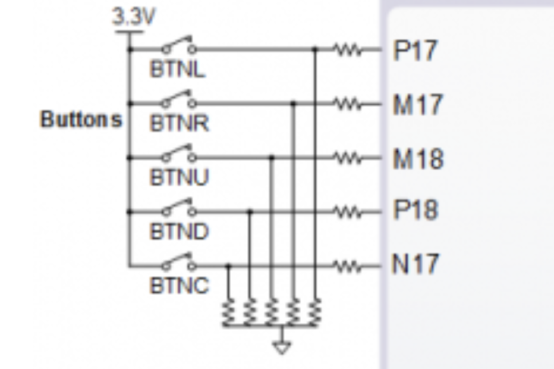
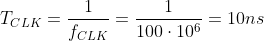

# Lab 6: Binary counter

## Preparation tasks (done before the lab at home)

The Nexys A7 board provides five push buttons for user applications.

1. From [reference manual](https://reference.digilentinc.com/reference/programmable-logic/nexys-a7/reference-manual) scheme of the circuit.
 
 
 
 | **STATE** | **Logic value** |
 | :-: | :-: |
 | pressed | 1 |
 | not pressed | 0 |
 
 
 
2. Calculate how many periods of clock signal with frequency of 100&nbsp;MHz contain time intervals 2&nbsp;ms, 4&nbsp;ms, 10&nbsp;ms, 250&nbsp;ms, 500&nbsp;ms, and 1&nbsp;s. Write values in decimal, binary, and hexadecimal forms.

   &nbsp;
   
   &nbsp;

   | **Time interval** | **Number of clk periods** | **Number of clk periods in hex** | **Number of clk periods in binary** |
   | :-: | :-: | :-: | :-: |
   | 2&nbsp;ms | 200 000 | `x"3_0d40"` | `b"0011_0000_1101_0100_0000"` |
   | 4&nbsp;ms |
   | 10&nbsp;ms |
   | 250&nbsp;ms |
   | 500&nbsp;ms |
   | 1&nbsp;sec | 100 000 000 | `x"5F5_E100"` | `b"0101_1111_0101_1110_0001_0000_0000"` |
