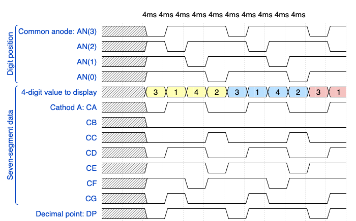

# Lab 7: Driver for multiple seven-segment displays

## Preparation tasks (done before the lab at home)

A common way to control multiple displays is to gradually switch between them. We control (connect to supply voltage) only one of the displays at a time, as can be seen [here](https://engineeringtutorial.com/seven-segment-display-working-principle/).

Due to the physiological properties of human vision, it is necessary that the time required to display the whole value is a maximum of 16&nbsp;ms. If we display four digits, then the duration of one of them is 4&nbsp;ms. If we display eight digits, the time is reduced to 2&nbsp;ms, etc.

1. from [reference manual](https://reference.digilentinc.com/reference/programmable-logic/nexys-a7/reference-manual) 

> The figure above was created in [WaveDrom](https://wavedrom.com/) digital timing diagram online tool. The figure source code is as follows:
